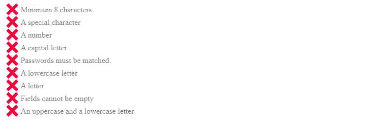
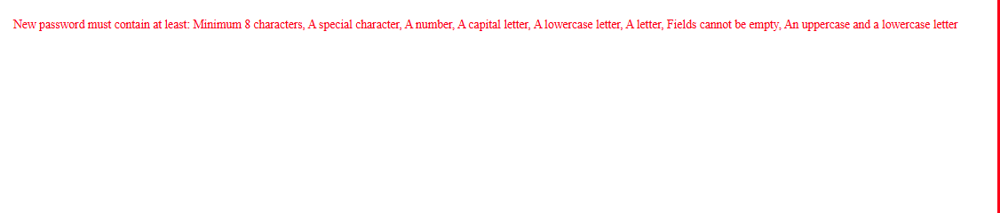

<div align="center" style="width:100%;">

<h2>🔒 React Advanced Password Checklist</h2>

<p>
A <strong>highly customizable</strong> React component for real-time password strength validation.<br>
Instantly display which password requirements are met as users type, improving both security and user experience.
</p>

<table width="100%">
    <tr>
        <td align="center"><strong>Install Package</strong></td>
        <td>
            <code>npm i react-advanced-pwcl</code>
            <button onclick="navigator.clipboard.writeText('npm i react-advanced-pwcl')" style="margin-left:8px;padding:2px 8px;font-size:0.9em;cursor:pointer;">Copy</button>
        </td>
    </tr>
    <tr>
        <td align="center"><strong>Version</strong></td>
        <td></td>
    </tr>
    <tr>
        <td align="center"><strong>License</strong></td>
        <td></td>
    </tr>
    <tr>
        <td align="center"><strong>Repository</strong></td>
        <td><a href="https://github.com/mdsabbiralmamon/advanced-react-pwcl">GitHub &rarr;</a></td>
    </tr>
    <tr>
        <td align="center"><strong>React Support</strong></td>
        <td></td>
    </tr>
    <tr>
        <td align="center"><strong>TypeScript</strong></td>
        <td></td>
    </tr>
    <tr>
        <td align="center"><strong>Bundle Size</strong></td>
        <td></td>
    </tr>
    <tr>
        <td align="center"><strong>Publisher</strong></td>
        <td><a href="https://github.com/mdsabbiralmamon">mdsabbiralmamon</a></td>
    </tr>
</table>

</div>

---

## 🚀 Features

- **Real-time validation**: Instantly shows which password rules are met.
- **Highly customizable**: Control rules, messages, icons, colors, and layout.
- **Localization support**: Easily provide custom messages or translations.
- **TypeScript ready**: Full TypeScript support and types.
- **RTL support**: Right-to-left layout for internationalization.
- **Lightweight**: Minimal bundle size.

---

## 🖥️ Demo

### Render List


### Text Only Render


---

## 📦 Installation

Install via npm:

```bash
npm install react-advanced-pwcl
```

Or with yarn:

```bash
yarn add react-advanced-pwcl
```

> **Note:** `react` is a peer dependency. Use this package within a React project.

---

## ⚡ Basic Usage

```jsx
import React, { useState } from "react";
import PasswordChecklist from "react-advanced-pwcl";

const SignUp = () => {
    const [password, setPassword] = useState("");
    const [passwordAgain, setPasswordAgain] = useState("");
    return (
        <form>
            <label>Password:</label>
            <input type="password" onChange={e => setPassword(e.target.value)} />
            <label>Password Again:</label>
            <input type="password" onChange={e => setPasswordAgain(e.target.value)} />

            <PasswordChecklist
                rules={["minLength", "specialChar", "number", "capital", "match"]}
                minLength={5}
                value={password}
                valueAgain={passwordAgain}
                onChange={isValid => {}}
            />
        </form>
    );
};
```

---

## 🌍 Custom Messages & Localization

Provide custom messages or translations for each rule:

```jsx
<PasswordChecklist
    rules={["minLength", "specialChar", "number", "capital", "match"]}
    minLength={8}
    value={password}
    valueAgain={passwordAgain}
    messages={{
        minLength: "Password has at least 8 characters.",
        specialChar: "Password contains a special character.",
        number: "Password includes a number.",
        capital: "Password contains an uppercase letter.",
        match: "Passwords match.",
    }}
/>
```

---

## 🛡️ Supported Rules

Configure the checklist to display only the rules you require, in any order:

- **minLength**: Password meets the minimum length (`minLength` prop required)
- **maxLength**: Password does not exceed the maximum length (`maxLength` prop required)
- **specialChar**: Contains at least one special character ([see list](https://github.com/mdsabbiralmamon/advanced-react-pwcl/blob/main/README.md#ComponentProps))
- **number**: Contains at least one numeric digit
- **capital**: Contains at least one uppercase letter
- **match**: Password and confirmation match (`valueAgain` prop required)
- **letter**: Contains at least one letter (uppercase or lowercase)
- **lowercase**: Contains at least one lowercase letter
- **notEmpty**: Both password fields are non-empty (`valueAgain` prop required)
- **capitalAndLowercase**: Contains both uppercase and lowercase letters
- **noSpaces**: Does not contain spaces

---

## ⚙️ Component Props

| Prop              | Description                                                                                                                                                                                                                               | Type     | Required                        | Default                                                       |
|-------------------|-------------------------------------------------------------------------------------------------------------------------------------------------------------------------------------------------------------------------------------------|----------|----------------------------------|---------------------------------------------------------------|
| rules             | Array of rules to validate and display. Options: `minLength`, `maxLength`, `specialChar`, `number`, `letter`, `capital`, `match`, `lowercase`, `notEmpty`, `capitalAndLowercase`, `noSpaces`                                             | array    | yes                              |                                                               |
| value             | Current password value                                                                                                                                                                                                                    | string   | yes                              |                                                               |
| valueAgain        | Password confirmation value (required for `match` and `notEmpty` rules)                                                                                                                            | string   | Only with `match`/`notEmpty`     |                                                               |
| minLength         | Minimum password length (required for `minLength` rule)                                                                                                                                            | number   | Only with `minLength` rule       |                                                               |
| maxLength         | Maximum password length (required for `maxLength` rule)                                                                                                                                            | number   | Only with `maxLength` rule       |                                                               |
| specialCharsRegex | Custom regex for special character validation                                                                                                                | RegExp   |                                  | `/[~`¿¡!#$%\^&*€£@+÷=\-\[\]\\';,/{}\(\)\|\\":<>\?\.\_]/g`     |
| onChange          | Callback triggered when rule validity changes. Receives `(isValid: boolean, failedRules: string[])`                                                          | function |                                  | `(isValid, failedRules) => {}`                                |
| messages          | Custom messages for each rule (object with rule keys and string values)                                                                                      | object   |                                  |                                                               |
| className         | Custom class for the component wrapper                                                                                                                       | string   |                                  |                                                               |
| rtl               | Enable right-to-left layout                                                                                                                                 | boolean  |                                  | false                                                         |
| hideIcon          | Hide the default SVG icons                                                                                                                                  | boolean  |                                  | false                                                         |
| style             | Inline styles for the component wrapper                                                                                                                     | object   |                                  |                                                               |
| iconSize          | Size of the checkmark/X icons                                                                                                                               | number   |                                  | 18                                                            |
| validTextColor    | Color for valid rule text                                                                                                                                   | string   |                                  | Inherited                                                     |
| invalidTextColor  | Color for invalid rule text                                                                                                                                 | string   |                                  | Inherited (opacity 0.5)                                       |
| validColor        | Color for the checkmark icon (not used with custom icons)                                                                                                   | string   |                                  | `#4BCA81`                                                     |
| invalidColor      | Color for the X icon (not used with custom icons)                                                                                                           | string   |                                  | `#FF0033`                                                     |
| iconComponents    | Custom icons: `{ ValidIcon: <Node>, InvalidIcon: <Node> }`                                                                                                  | object   |                                  |                                                               |
| renderAsMessagesOnly    | Enable line instead of List                                                                                                  | Boolean   |                                  |      false                                                         | 
| messageOnlyColor    | Color for single line messages                                                                                                   | String   |                                  |      red                                                         | 
| messageOnlyPrefix    | Add prefix for single line messages                                                                                                   | String   |                                  |      New password must contain at least:                                                         | 

## CSS Classes

- `.valid` – Applied to valid rule messages
- `.invalid` – Applied to invalid rule messages

## Contributing

Contributions are welcome! Please submit pull requests with clear descriptions and include relevant unit tests and, if applicable, Storybook stories.

## Local Development

Install dependencies:

```bash
npm install
```

Start Storybook for local development:

```bash
npm run storybook
```
